# Mike Lyndon Bigcas

**Full Stack Developer & UI/UX Designer**

Passionate about building beautiful, functional web experiences and crafting innovative VS Code extensions. Specialized in modern web technologies and intuitive interface design.

---

## GitHub Statistics

<!-- STATS:START -->

<!-- Generated stats images (updated by GitHub Action) -->

<!-- STATS:END -->

## Top Languages

<!-- LANGS:START -->
<!-- Generated by GitHub Action -->

<!-- LANGS:END -->

---

## About Me

| | |
|---|---|
| **Currently Working On** | Full Stack Web Applications & VS Code Extensions |
| **Learning** | Advanced React Patterns & System Design |
| **Availability** | Full-time, Part-time, Freelance |
| **Profile Views** |  |

---

## Tech Stack

### Web Development

### Databases & Backend

### VS Code Extensions

### Design Tools

---

## Contribution Activity

---

## Connect With Me

---

**Made with care by Mike Lyndon Bigcas**

